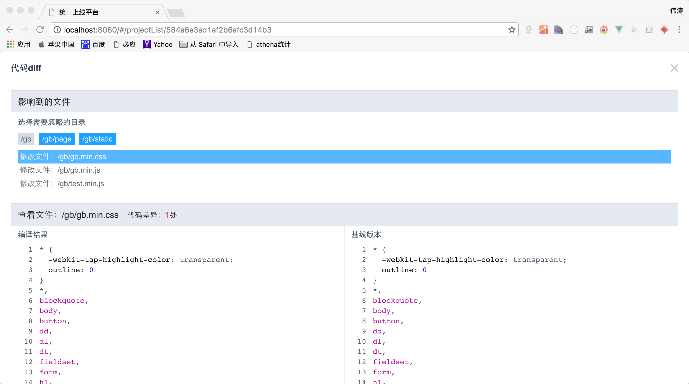
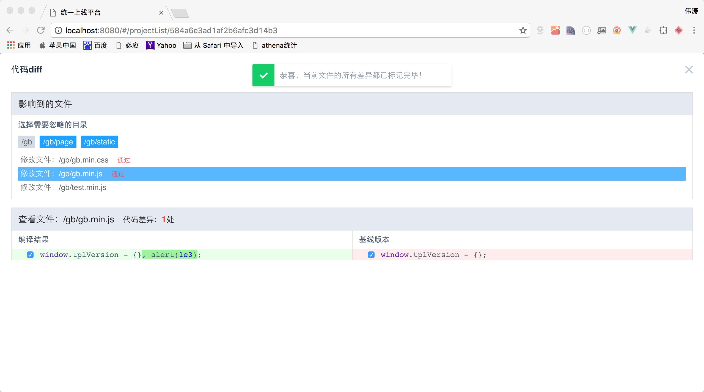

# 统一上线管理平台

请先查看相关[设计说明](DESIGN.md)

### 快速开始

项目依赖 **MongoDB**，需要提前安装，**Node** 版本6.0以上。

技术栈 **Vue 2.0** + **Webpack 2.0** + **KoaJs 2.0** + **ES2015**

首先拷贝项目

```
$ git clone git@github.com:o2team/deploy.git
```

然后安装项目依赖，时间较长，请耐心等待

```
$ npm install
```

接着就可以运行了，执行如下操作（暂时）

```
$ mongod  --dbpath ./data/db  //启动mongodb数据服务
$ node app/server/start.js  // 启动服务端程序
$ npm run dev  //执行前端项目编译并预览
```

### 界面截图







